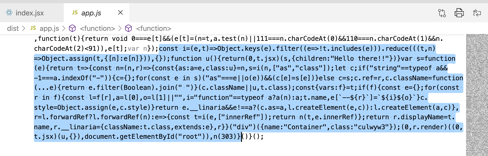

Figuring out an IE dev-time issue with Linaria...

- first commit: just a super bare bones webpack 5 + react 17 setup

- second commit: installed linaria, making sure to add browserslist config to support ie 10 & 11

  - You can see that, just using the `css` template literal for creating classnames,  IE doesn't run into any problems. The `app.js` bundle that webpack outputs doesn't contain any ES6 syntax like the spread operator or const or arrows. (Babel takes care of this.)

- third commit: IE syntax errors in production build if using `styled`

  - If you look at the production output when using the `styled` React helper, Linaria's code now contains ES6 features like the spread operator in the `cx` helper, `const` usage, a dynamic property key, destructuring, and generally a bunch of arrow functions, etc.

    Hopefully there's some way I can fix this! I'd love to use Linaria in production..

